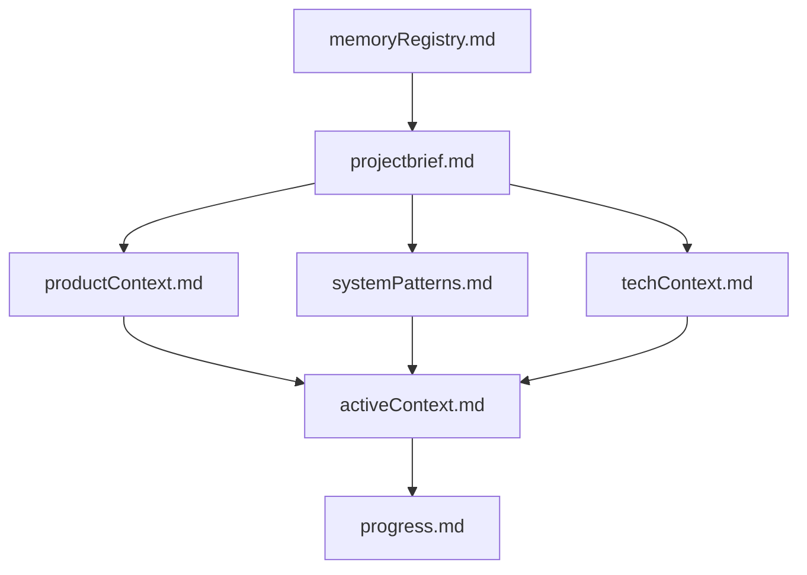

# Memory Registry

This file serves as the central index for all documents within Cline's Memory Bank for the RepoPilot project.

## Core Memory Files

| File                 | Status         | Last Updated | Notes                                    |
|----------------------|----------------|--------------|------------------------------------------|
| projectbrief.md      | To be created  | -            | Core project goals and requirements      |
| productContext.md    | To be created  | -            | The "why" and "how" of the project       |
| systemPatterns.md    | To be created  | -            | Architecture and technical decisions     |
| techContext.md       | To be created  | -            | Technologies, setup, constraints         |
| activeContext.md     | To be created  | -            | Current work focus and next steps        |
| progress.md          | To be created  | -            | Project status, what works, known issues |
| memoryRegistry.md    | **Created**    | 2025-04-03   | This index file                        |

## Additional Context Files

*(None currently)*

## Dependencies

## Recent Updates

- 2025-04-03: Initialized Memory Bank structure. Created `memoryRegistry.md`.